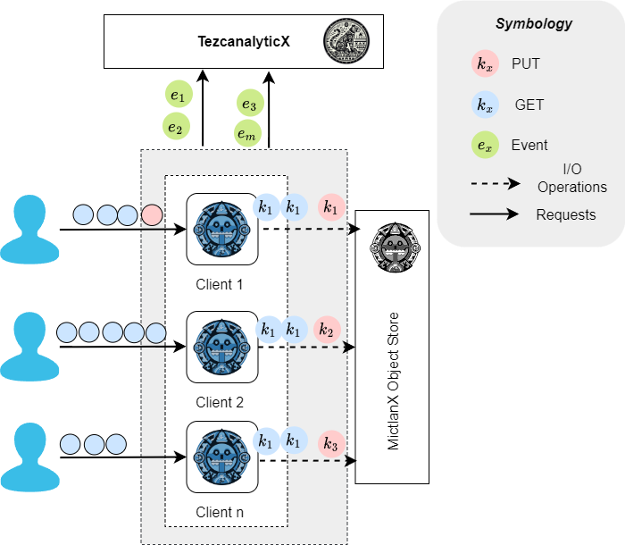

<p align="center">
  
</p>
<div align=center>
<a href="https://test.pypi.org/project/mictlanx/"></a>
</div>
<div align=center>
        <h2>TezcanalyticX: <span style="font-weight:normal;"> Production and consumption pattern analyzer for high available serverless computing</span></h2>
</div>


## Getting started 🚀
### Prerequisites 📋
To run the basic first you need to install the following software tools:

-  Python >= 3.8  (https://www.python.org/downloads/)
-  Pip is intalled on your system when you install python
-  Install the dependencies (this repo has a ```requirements.txt``` file):
    ```bash
    pip3  install -r ./requirements.txt
    ```


### Introduction 
<!-- This is the analyzer server that receive from $n$ clients a batch of events of size $m$.  -->
The production and consumption pattern analyzer for serverless storage systrem is a sophisticated system software designed to predictive insights and actionable recommendations to improve storage utilziation, performance and availability. 
<p align="center">
  
</p>

### Deployment

First you need to run the server using the following comand, you must be in ```src/``` folder:
```sh
 uvicorn server:app --reload --port 45000
```

this command run a server on port ```45000```. ⚠️You can change the port but this implies a update in the logger handler.

### Testing

To send a workload events to the analyzer you need to run the following script located at  ```tests/``` at the same level there is a ```workload1.csv``` that contains a simple workload you can generate your own workloads or download a workload with 10k events [link](https://alpha.tamps.cinvestav.mx/v0/mictlanx/peer0/api/v4/buckets/mictlanx/72d28f66c6c0905b8e3fa78ee7adda796113d4df8c5dec5d1b67f3f585c7fc8d):
```bash
python ./basic_workload.py
```

## Popularity model

### Frecuency
$$feq_{i}(t)=\frac{\#access_{i}(t)}{\#total\_access(t)}$$
### Popularity
$$p_{i}(t+1)=p_{i}(t)+\theta\times feq_{i}(t)$$

$$p_{i}(\Delta) \geq p_{th}$$

### Data lifetime (coming soon) ❗
### Request distribution over time (coming soon) ❗

## Contributing

Contributions are what make the open source community such an amazing place to learn, inspire, and create. Any contributions you make are **greatly appreciated**.

If you have a suggestion that would make this better, please fork the repo and create a pull request. You can also simply open an issue with the tag "enhancement".
Don't forget to give the project a star! Thanks again!

1. Fork the Project
2. Create your Feature Branch (`git checkout -b feature/AmazingFeature`)
3. Commit your Changes (`git commit -m 'Add some AmazingFeature'`)
4. Push to the Branch (`git push origin feature/AmazingFeature`)
5. Open a Pull Request

<p align="right">(<a href="#top">back to top</a>)</p>


<!-- LICENSE -->
## License

Distributed under the MIT License. See `LICENSE.txt` for more information.

<p align="right">(<a href="#top">back to top</a>)</p>


<!-- CONTACT -->
## Contact

 Ignacio Castillo - [@NachoCastillo]() - jesus.castillo.b@cinvestav.mx

<p align="right">(<a href="#top">back to top</a>)</p>
